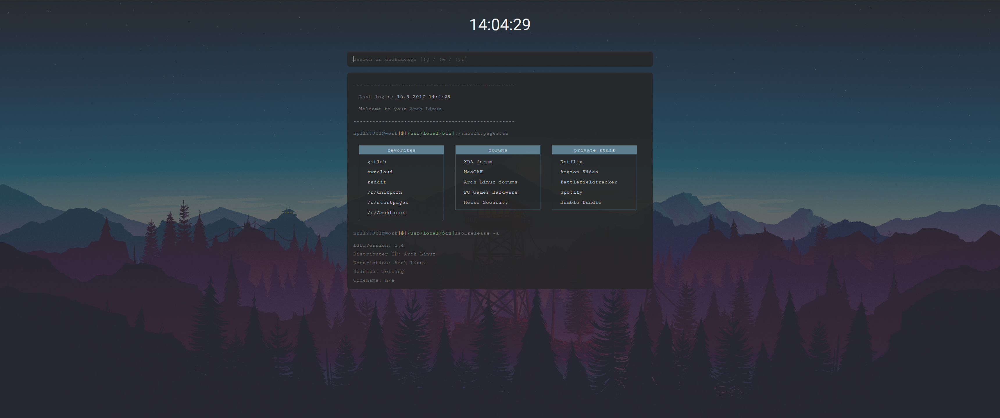

# startpage

## Description
This is a simple startpage for my Arch Linux workstation at home. 
The used image in my source code is from https://www.reddit.com/r/unixporn/comments/5qsn18/gnome_material_desktop/. 
If you want to change the background just go into my stylesheet (/css/stylesheet.css) and change the url under body. 
This page supports up to 21:9 and a resolution of 3440x1440. 

## Screenshots

## Dependencies
You just need a modern browser which support javascript. 
 
This page was tested on:
* Firefox
* Google Chrome
* Opera
* Opera Neon
* Vivaldi
* Microsoft Edge

## Feedback
I hope you like my work so it would be great if you write a comment under my reddit post [https://www.reddit.com/r/startpages/comments/65ows6/my_arch_linux_console_startpage/].
